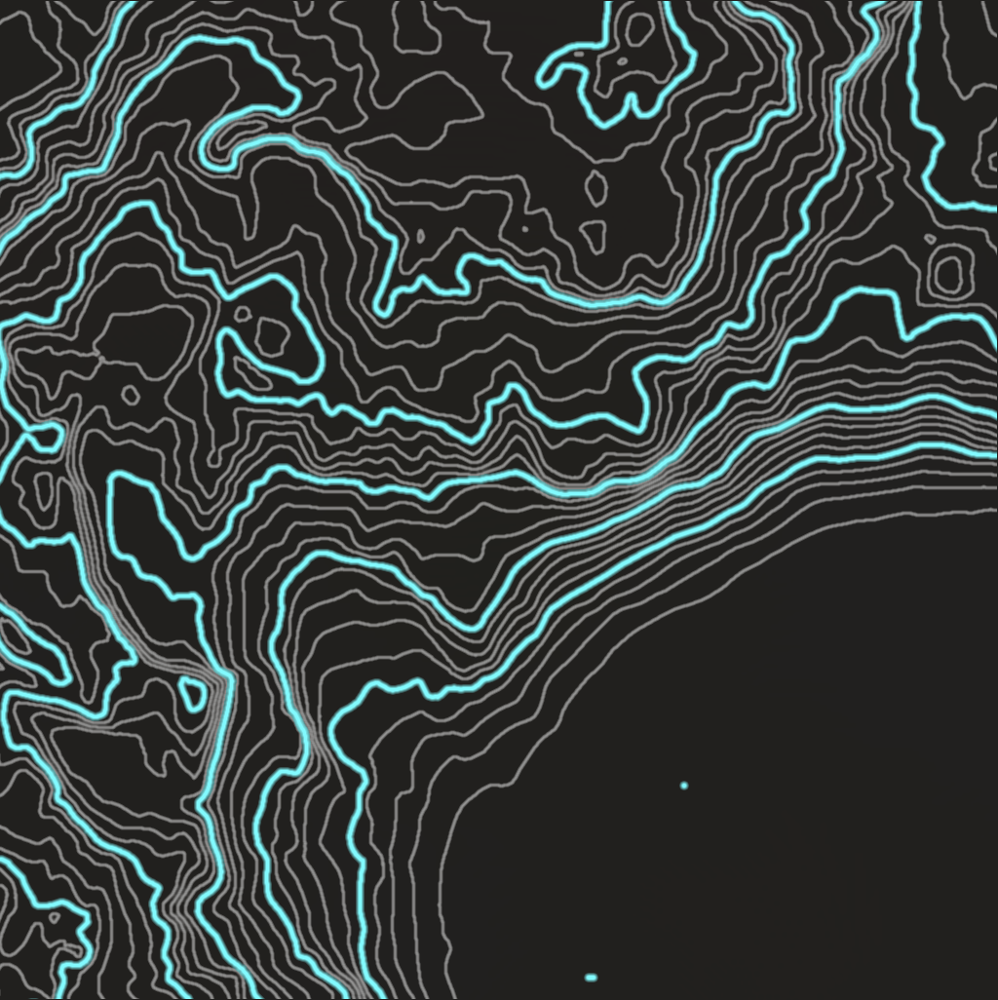

# Contour Map Generator

Unreal Engine 5 plugin for generating contour maps.  
This repository includes documentation in both English and Japanese.

## 🌐 Purchase/Download

This plugin is available for purchase on Epic Games' marketplace, **Fab**.  

➡ **Fab - Contour Map Generator**  
<[Fab : Contour Map Generator](https://www.fab.com/ja/listings/9de789d4-2edc-4f39-8962-fc5b0b07dc24)>

## 📘 Documentation

- [English Documentation](./en/Readme.md)
- [日本語ドキュメント](./jp/Readme.md)

## Features

- Export terrain contour maps from UE5 levels
- Display zoomable minimaps with orientation and level of detail

