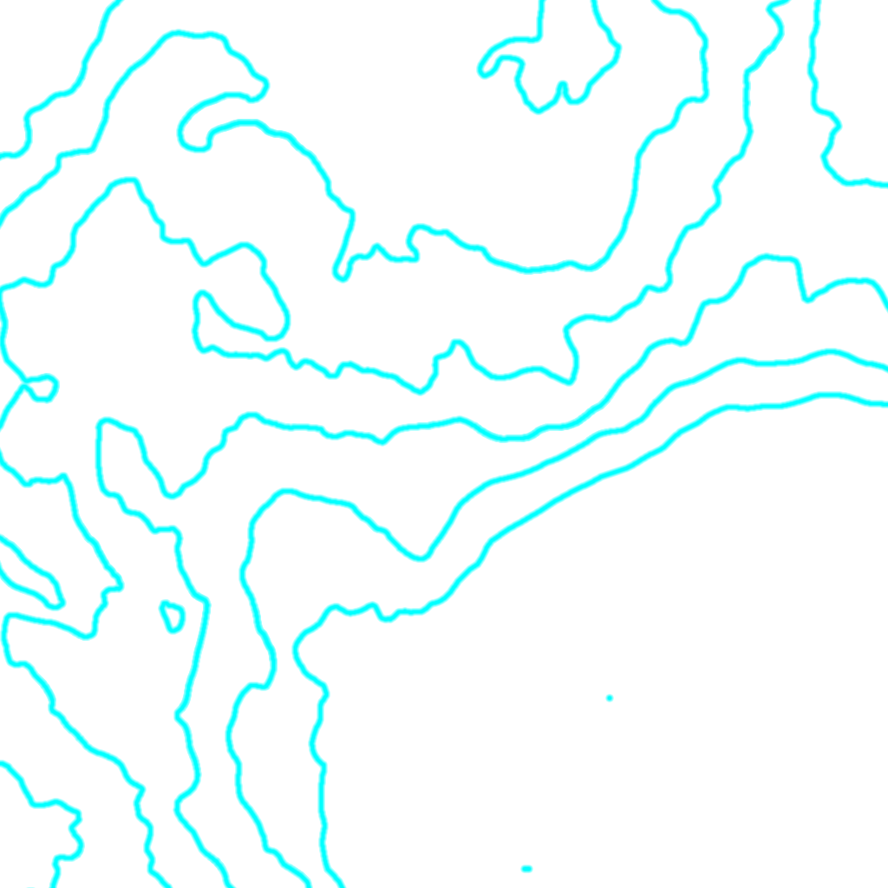

# Contour Map Generator

Unreal Engine 5 plugin for generating contour maps.  
This repository includes documentation in both English and Japanese.

## 📘 Documentation

- [English Documentation](./en/README.md)
- [日本語ドキュメント](./jp/README.md)

## Features

- Export terrain contour maps from UE5 levels
- Display zoomable minimaps with orientation and level of detail

