# Contour Map Generator


## Table of Contents

- [Package Contents](#package-contents)
- [Quick Start](#quick-start)
- [U_CMG_ContourMapSettingsAsset Details](#u_cmg_contourmapsettingsasset-details)
- [How to Create WB_CMG_ContourMapBase](#how-to-create-wb_cmg_contourmapbase)


## Package Contents

```bash
ContourMapGenerator Content
├── DA_CMG_ContourMapSettings     : Main settings for contour maps
├── DA_CMG_ContourMapTileList     : List of contour-map images
├── EUW_CMG_CreateContourMap      : Editor Utility Widget – export images to a folder
├── EUW_CMG_TextureToDataAsset    : Editor Utility Widget – pack images into a Data Asset
├── WB_CMG_ContourMapBase         : Demo widget that shows the contour map  
│                                   • choose center, heading, zoom level, and render-target size
├── Materials
│   ├── T_CMG_SampleTexture         : Sample texture
│   ├── M_CMG_ContourMapMaterial  : Converts a UTexture to a Material
│   └── T_RoundMaskTexture
└── Demo
    ├── ContourMapTexture         : Exported demo images
    ├── Game
    │   ├── BP_CMG_Demo_GameMode
    │   └── BP_CMG_DemoCharacter  : Press M to open WBP_CMG_Demo_BigMap
    ├── Input
    │   ├── Actions
    │   └── IMC_CMG_Default
    ├── Map                       : Demo level
    └── UI
        ├── WBP_CMG_Demo_BigMap   : Mouse wheel changes zoom
        ├── WBP_CMG_Demo_KeyInfo
        └── WBP_CMG_Demo_MiniMap  : Keeps player at center and camera up
```


## Quick Start

### 1. Add the plugin to your project

#### 1.1. Launch Unreal Engine 5, go to **Edit ▸ Plugins**, and enable **Contour Map Generator**.


#### 1.2. Restart the editor.


### 2. Create map settings
#### 2.1. In the Content Browser, create a Data Asset using `U_CMG_ContourMapSettingsAsset` as the parent

<table>
<tr>
  <td>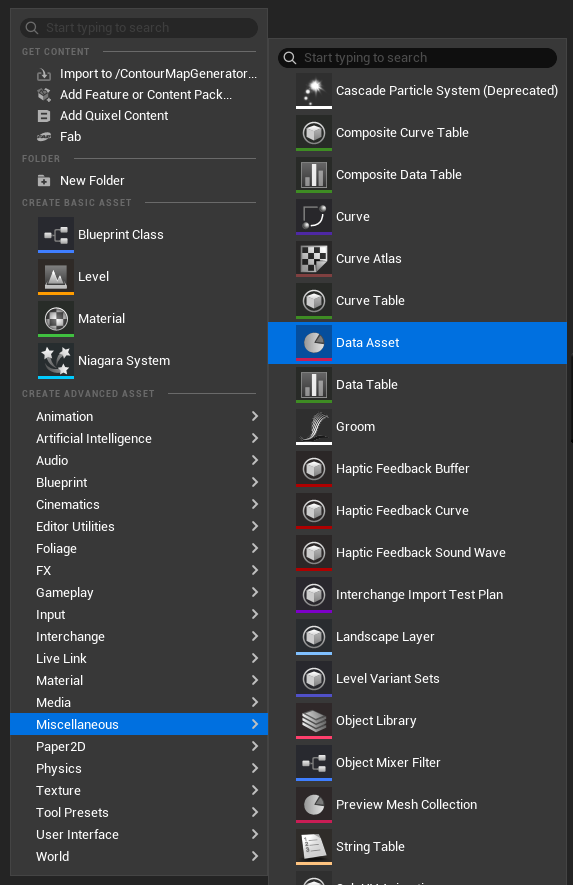
  <td>
</tr>
</table>

#### 2.2. For details on each field, see [U_CMG_ContourMapSettingsAsset Details](#u_cmg_contourmapsettingsasset-details)

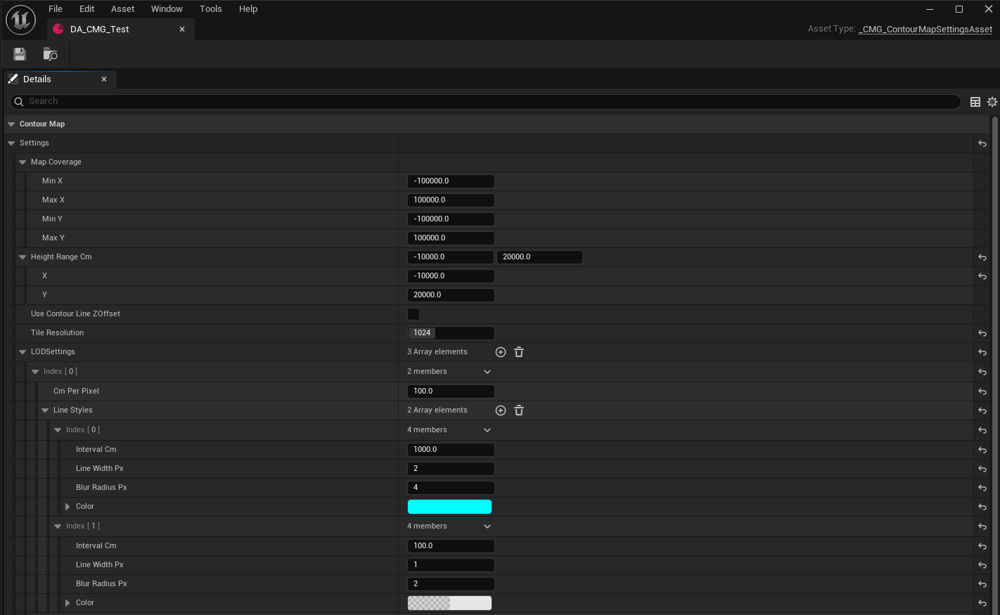


### 3. Prepare the map

#### 3.1. Duplicate the level that will be captured

#### 3.2. Remove any objects that may block the contour capture (e.g., characters or props placed in the level)


### 4. Export images

#### 4.1. Open the Editor Utility Widget. (`EUW_CMG_CreateContourMap`)

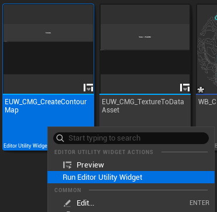

#### 4.2. Create/choose an output folder, then paste its path.

<table>
<tr>
  <td>
  <td>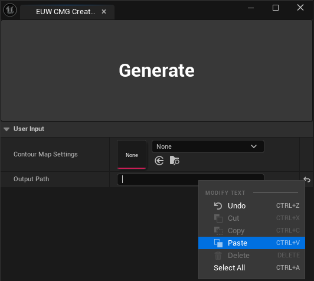
</tr>
</table>

#### 4.3. Select the Data Asset you made.

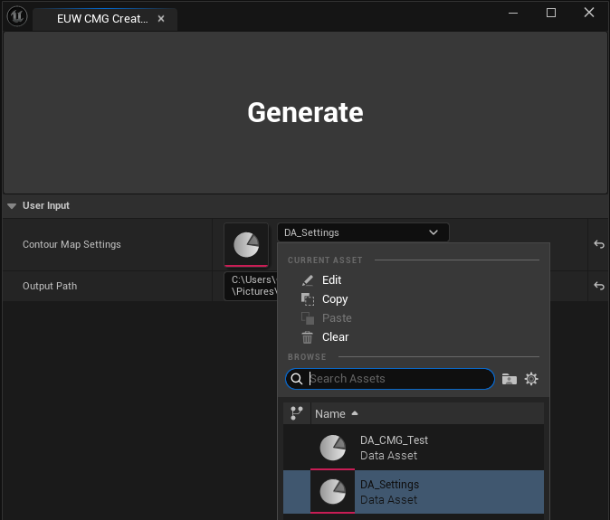

#### 4.4. Click the [Generate] button


### 5. Import images

#### 5.1. Make a new folder in the Content Browser.

#### 5.2. Import the exported images.

#### 5.3. In the Content Browser, create a Data Asset using `U_CMG_ContourMapTileDataAsset` as the parent

<table>
<tr>
  <td>
  <td>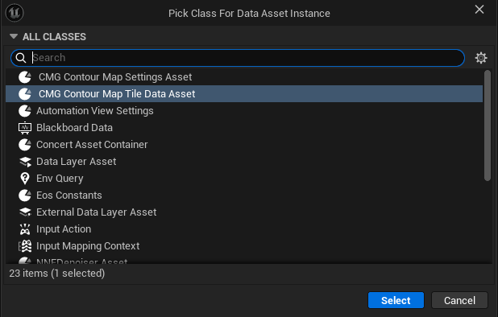
</tr>
</table>


#### 5.4. Open the Editor Utility Widget. (`EUW_CMG_TextureToDataAsset`)
<table>
<tr>
  <td>
  <td>
</tr>
</table>

#### 5.5. Folder path  
- If the path contains line breaks, delete them

<table>
<tr>
  <td>
  <td>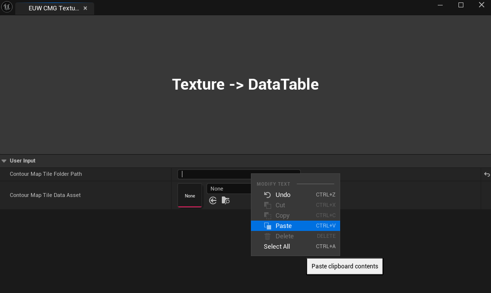
</tr>
</table>

#### 5.6. Assign your Tile Data Asset.

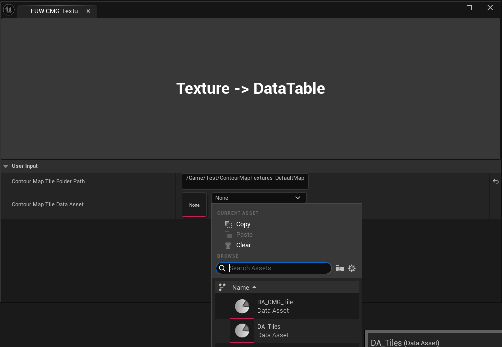

#### 5.7. Click the [**Texture → DataTable**] button

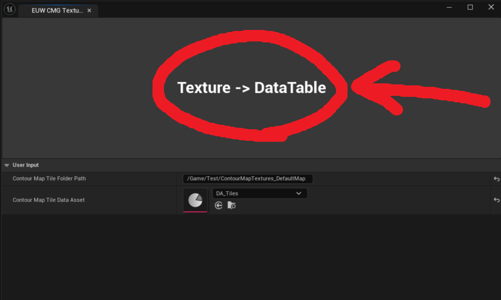

#### 5.8. A Data Table like this means success.


### 6. Make a widget that shows contours
- See [How to Create WB_CMG_ContourMapBase](#how-to-create-wb_cmg_contourmapbase) for full steps.

#### 6.1. Duplicate `WB_CMG_ContourMapBase` and rename it

```bash
ContourMapGenerator Content
├── DA_CMG_ContourMapSettings
├── DA_CMG_ContourMapTileList
├── EUW_CMG_CreateContourMap
├── EUW_CMG_TextureToDataAsset
├── WB_CMG_ContourMapBase      <= duplicate this
├── Materials
└── Demo
```

#### 6.2. Update its Data Asset
- Open the duplicated Widget Blueprint  
- Switch to the Graph tab  
- In the **Create Contour Map Renderer** node, set **SettingsAsset** and **TileDataAsset** to the Data Asset you created

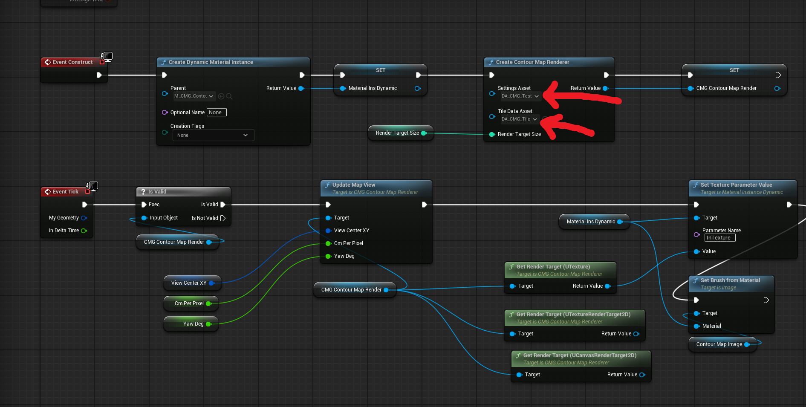


### 7. Using WB_CMG_ContourMapBase

```bash
ContourMapGenerator Content
├── DA_CMG_ContourMapSettings
├── DA_CMG_ContourMapTileList
├── EUW_CMG_CreateContourMap
├── EUW_CMG_TextureToDataAsset
├── WB_CMG_ContourMapBase
├── Materials
└── Demo
    ├── ContourMapTexture
    ├── Game
    ├── Input
    ├── Map
    └── UI
        ├── WBP_CMG_Demo_BigMap
        ├── WBP_CMG_Demo_KeyInfo
        └── WBP_CMG_Demo_MiniMap   <= example implementation
```

#### 7.1. Create a new Widget Blueprint

#### 7.2. Add WB_CMG_ContourMapBase

- Place `WB_CMG_ContourMapBase`, or the widget you created in [How to Create WB_CMG_ContourMapBase](#how-to-create-wb_cmg_contourmapbase)

- Adjust the size of `WB_CMG_ContourMapBase` to be square

- Set **IsVariable** to **true** on `WB_CMG_ContourMapBase`

<table>
<tr>
  <td>
  <td>
</tr>
</table>


#### 7.3. Set RenderTargetSize
- This value determines the pixel dimensions of the image returned by `UCMG_ContourMapRenderer`

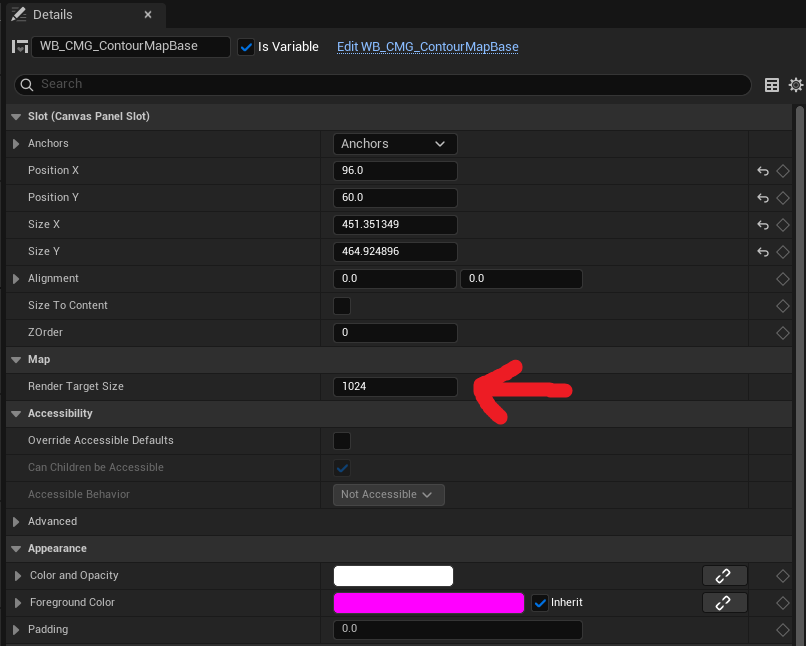

#### 7.4. Configure map center, rotation, and zoom
- Switch to the Graph tab  
- Call the `UpdateState` function on `UCMG_ContourMapRenderer`  
- Connect `UpdateState` to **Event Tick**  
- Assign your desired center coordinates to **ViewCenterXY**  
- Set **YawDeg** to the map’s rotation angle  
- Set **CmPerPixel** to the desired zoom level 

<table>
<tr>
<td>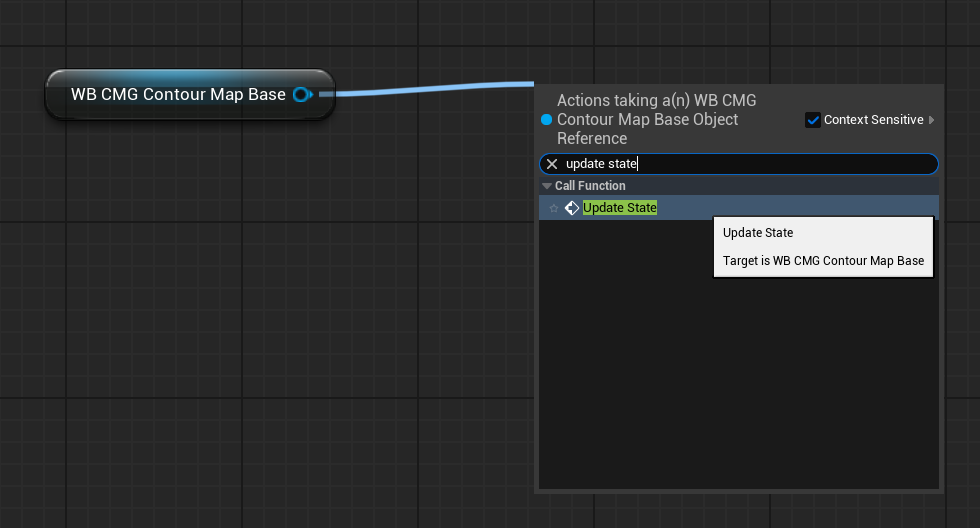
<td>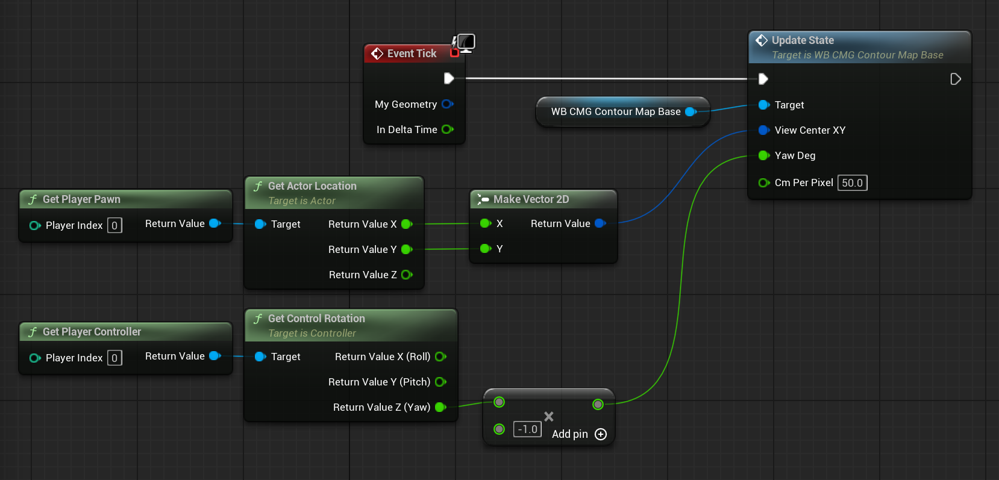
</tr>
</table>

<br>
<br>

---
<br>
<br>


#### Note: About UCMG_ContourMapRenderer
- `UCMG_ContourMapRenderer` stitches together imported images to produce a single contour map texture (RenderTarget).
- The output texture from `UCMG_ContourMapRenderer` is always a square (width = height).
- Its dimensions (width and height) are defined by **RenderTargetSize**.
- **RenderTargetSize** is fixed when `UCMG_ContourMapRenderer` is created and cannot be changed afterward.
- You can set the center, rotation, and zoom level via **ViewCenterXY**, **YawDeg**, and **CmPerPixel**.
- **CmPerPixel** defines how many centimeters in world space each pixel of the RenderTarget represents.


| Variable         | Type       | Description                                                             | Notes                                       |
|------------------|------------|-------------------------------------------------------------------------|---------------------------------------------|
| RenderTargetSize | int        | The width and height (in pixels) of the texture produced by `UCMG_ContourMapRenderer` | Set when `UCMG_ContourMapRenderer` is created |
| ViewCenterXY     | FVector2D  | The world-space (X, Y) coordinates used as the center of the contour map |                                             |
| YawDeg           | float      | The rotation angle (in degrees) applied to the generated texture        |                                             |
| CmPerPixel       | float      | Zoom level (cm per pixel). Multiply by **RenderTargetSize** to get the world size. |   |

<br>
<br>

---

<br>
<br>

## U_CMG_ContourMapSettingsAsset Details
<details>
<summary><strong>U_CMG_ContourMapSettingsAsset Details</strong></summary>


#### MapCoverage
- Defines the map area in world-space coordinates

<table>
<tr>
  <td>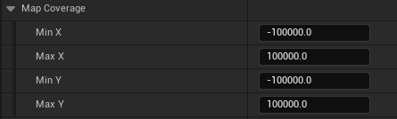
  <td>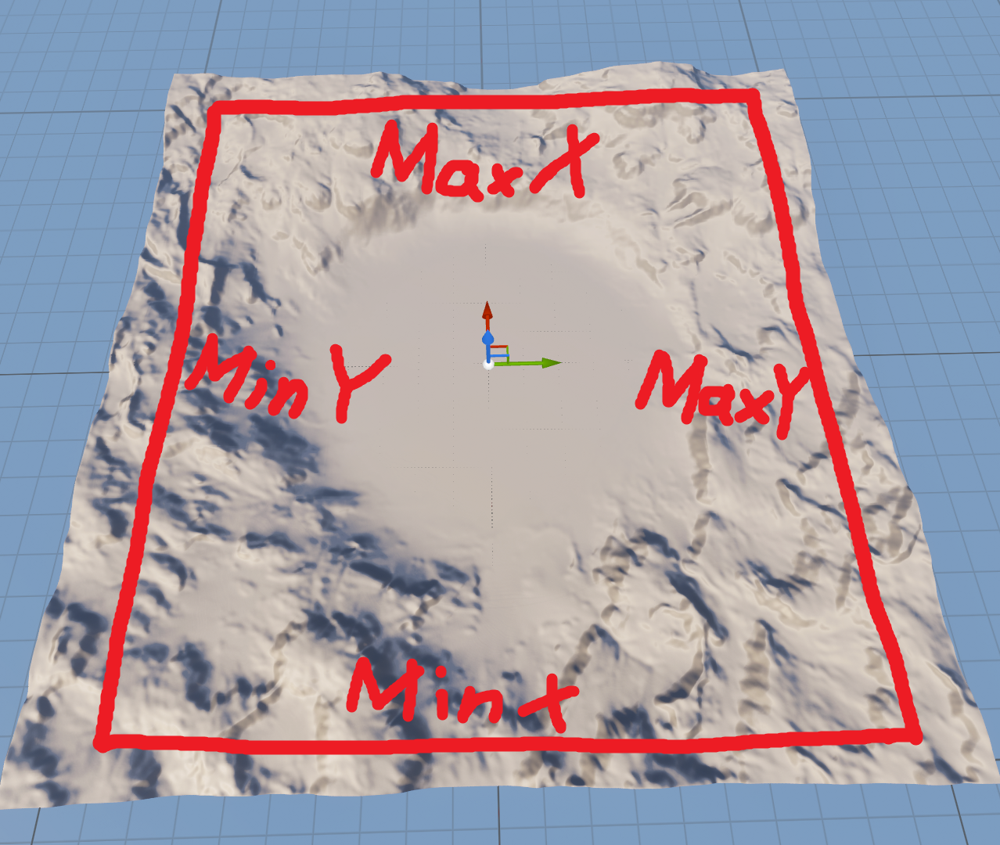
</tr>
</table>


#### HeightRangeCm
- Minimum and maximum height range (in centimeters) used when scanning terrain

<table>
<tr>
  <td>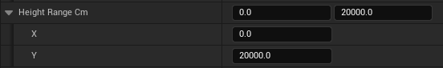
  <td>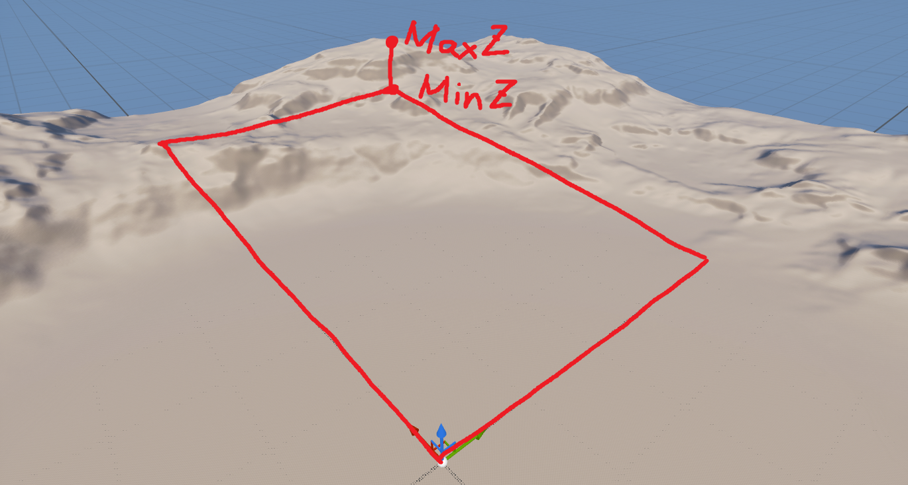
</tr>
</table>

#### ContourLineZOffset
- Offset value to adjust the height at which contour lines are drawn  
- Useful when contour lines and flat terrain share the same height, causing visual artifacts


#### TileResolution
- The resolution (width × height in pixels) for each split contour image  
- Enter the desired tile resolution for saving multiple images

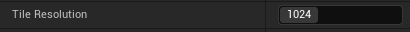

#### LODSettings
- Allows saving contour images at multiple zoom levels  
- Automatically selects and displays the best LOD setting based on the current zoom level


#### CmPerPixel
- The world-space length (in centimeters) represented by one pixel. Larger values result in a smaller scale (more zoomed out).

#### LineStyles
- Types of contour lines to draw  
- In the example below, thick blue lines every 20 m and thin white lines every 2 m

<table>
<tr>
  <td>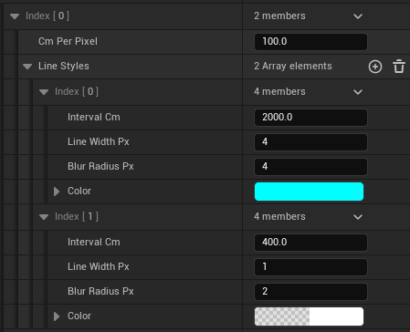
  <td>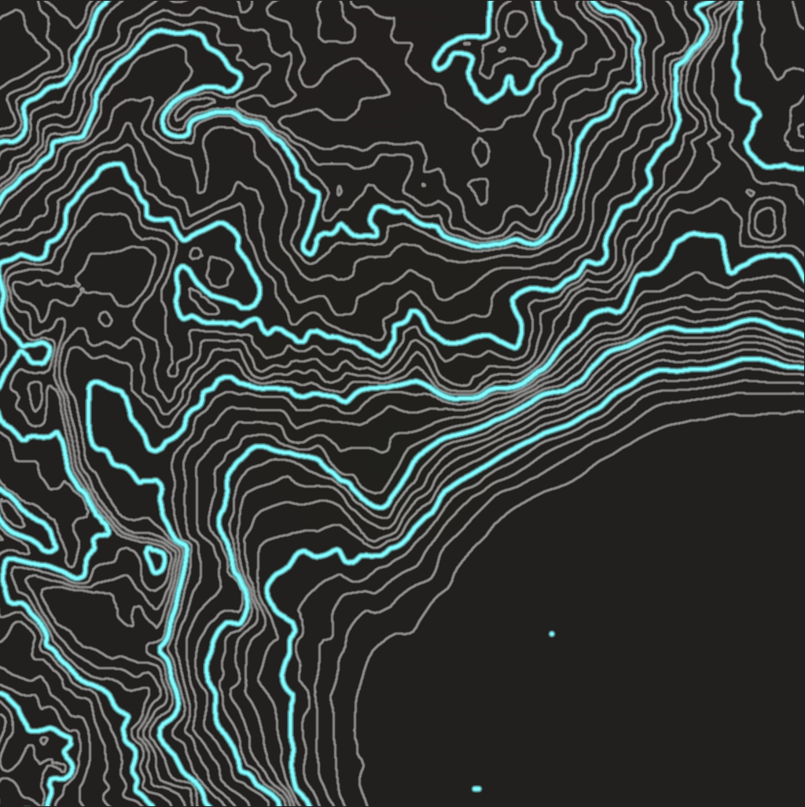
</tr>
</table>

#### IntervalCm
- Vertical spacing between contour lines (in centimeters)

#### LineWidthPx
- Thickness of the drawn contour line (in pixels)

#### BlurRadiusPx
- Blur radius applied to the contour texture (in pixels)  
- Higher values produce smoother lines but may lose fine detail

#### Color
- Color of the contour lines  
- Supports transparency


</details>


<br>
<br>


## How to Create WB_CMG_ContourMapBase

<details>
<summary><strong>How to Create WB_CMG_ContourMapBase</strong></summary>

#### 1. Create a new Widget Blueprint

<table>
<tr>
  <td>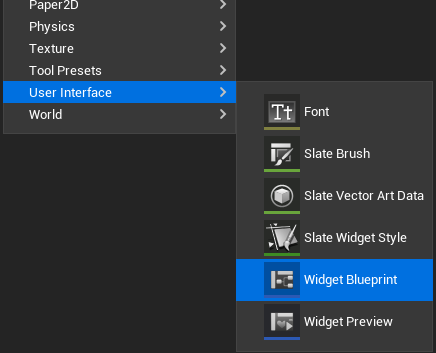
  <td>
</tr>
</table>

#### 2. Add a new Image
- Name the Image **ContourMapImage**
- Enable **IsVariable** in the Image’s settings
- Change **Appearance ▸ Brush ▸ Draw As** to **Rounded Box**

<table>
<tr>
  <td>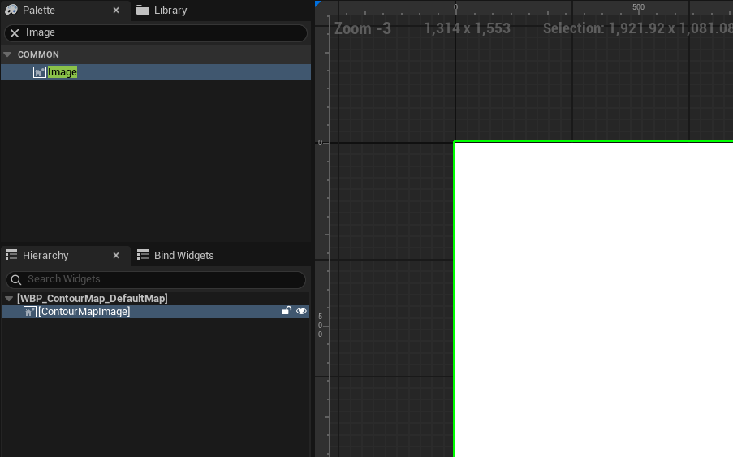
  <td>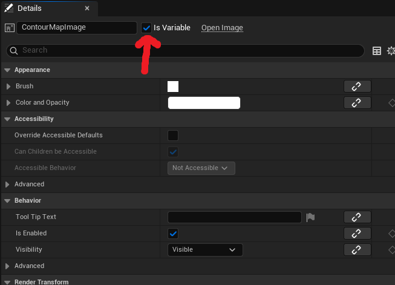
  <td>
</tr>
</table>

#### 3. Switch to the Graph and create new variables

| Type      | Variable Name   |
|-----------|-----------------|
| FVector2D | ViewCenterXY    |
| float     | YawDeg          |
| float     | CmPerPixel      |
| int       | RenderTargetSize|

#### 4. Change RenderTargetSize Details
- Set **Instance Editable** to **true**
- Set **Expose on Spawn** to **true**

<table>
<tr>
  <td>
  <td>
</tr>
</table>

#### 5. Create a new event
- Add a **Custom Event**
- Rename the event to **UpdateState**
- Connect the variables created in step 3 to this event

<table>
<tr>
  <td>
  <td>
</tr>
</table>

#### 6. Create a Dynamic Material Instance
- Set **Parent** to **M_CMG_ContourMap**
- Store the **Return Value** in a variable named **DynamicMaterialIns**

<table>
<tr>
  <td>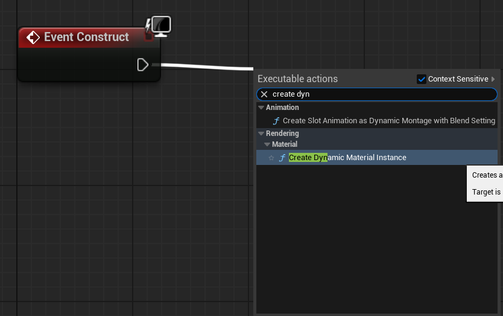
  <td>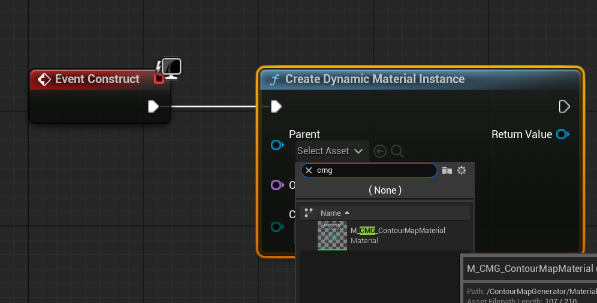
  <td>
  <td>
</tr>
</table>

#### 7. Create Contour Map Render
- Assign your created Data Asset to **Setting Asset**
- Assign your created Data Asset to **Tile Data Asset**
- Assign the **RenderTargetSize** variable to **Render Target Size**
- Store the **Return Value** in a variable named **CMG_ContourMapRender**

<table>
<tr>
  <td>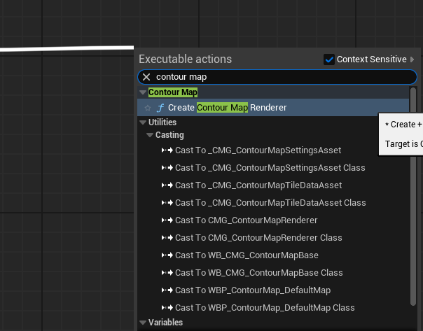
  <td>
  <td>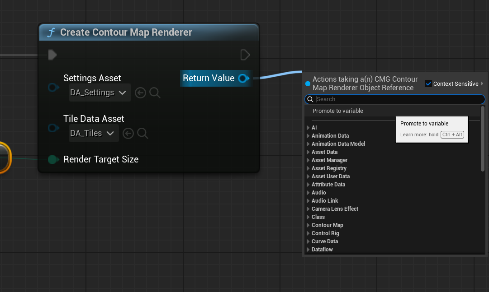
  <td>
</tr>
</table>

#### 8. Connect the nodes from steps 6 and 7 to **Event Construct**

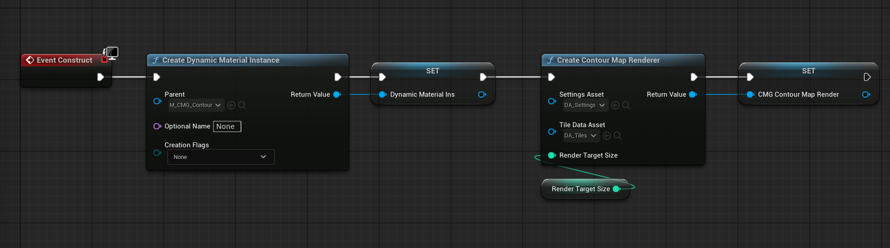

#### 9. Add an **IsValid** check
- Plug the `CMG_ContourMapRender` variable (from step 7) into the **Input Object** pin

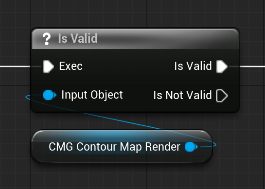

#### 10. Create **UpdateMapView**
- Plug `CMG_ContourMapRender` (step 7) into **Target**
- Plug `ViewCenterXY` (step 3) into **ViewCenterXY**
- Plug `CmPerPixel` (step 3) into **CmPerPixel**
- Plug `YawDeg` (step 3) into **YawDeg**

<table>
<tr>
  <td>
  <td>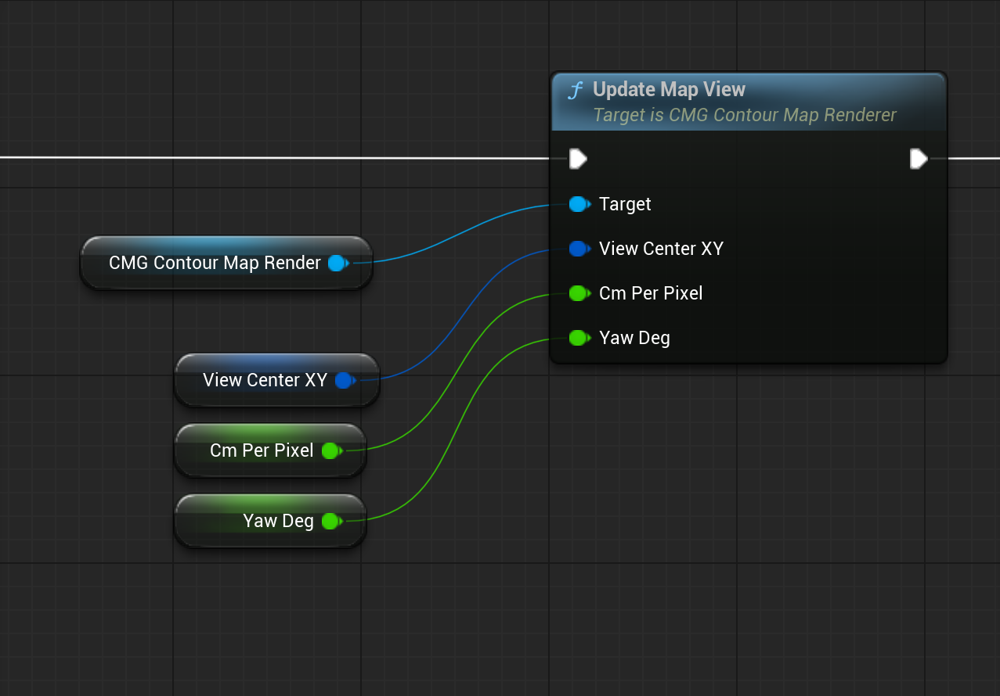
</tr>
</table>

#### 11. Create **SetTextureParameterValue**
- From your **DynamicMaterialIns** (step 6), add **SetTextureParameterValue**
- Change the **Parameter Name** to **InTexture**
- For **Value**, use the **GetRenderTarget (UTexture)** output from `CMG_ContourMapRender` (step 7)

<table>
<tr>
  <td>
  <td>
  <td>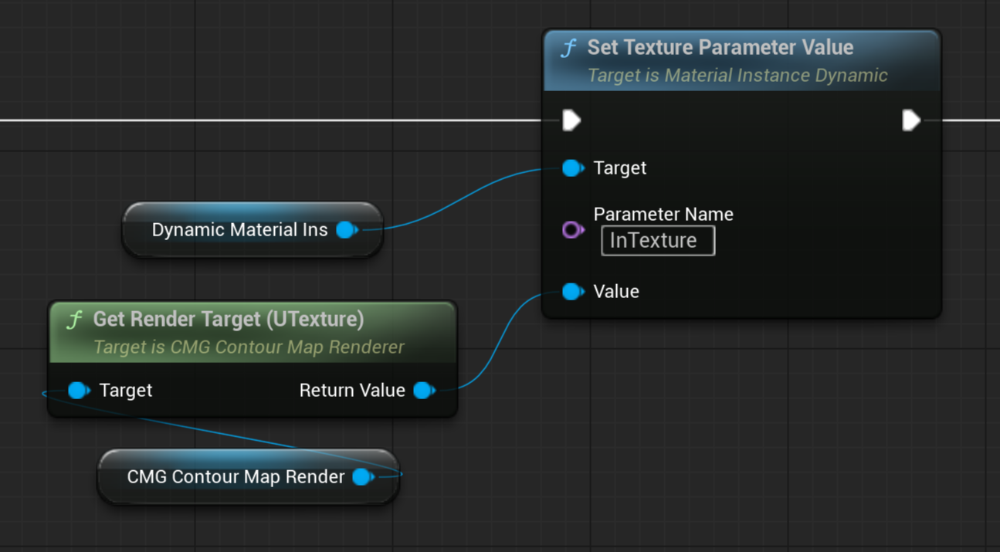
</tr>
</table>

#### 12. Create **SetBrushFromMaterial**
- From **ContourMapImage** (step 2), add **SetBrushFromMaterial**
- Plug your **DynamicMaterialIns** (step 6) into the **Material** input

<table>
<tr>
  <td>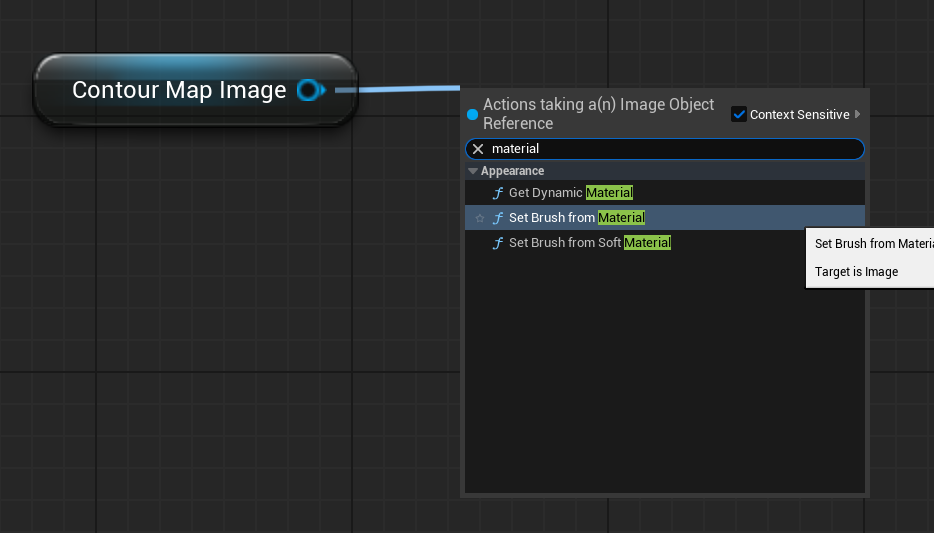
  <td>
</tr>
</table>

#### 13. Connect steps 9–12 to **Event Tick**

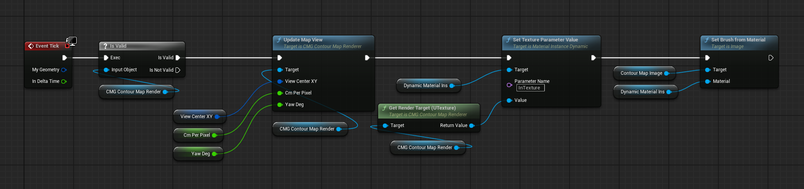

#### 14. Full Blueprint Overview

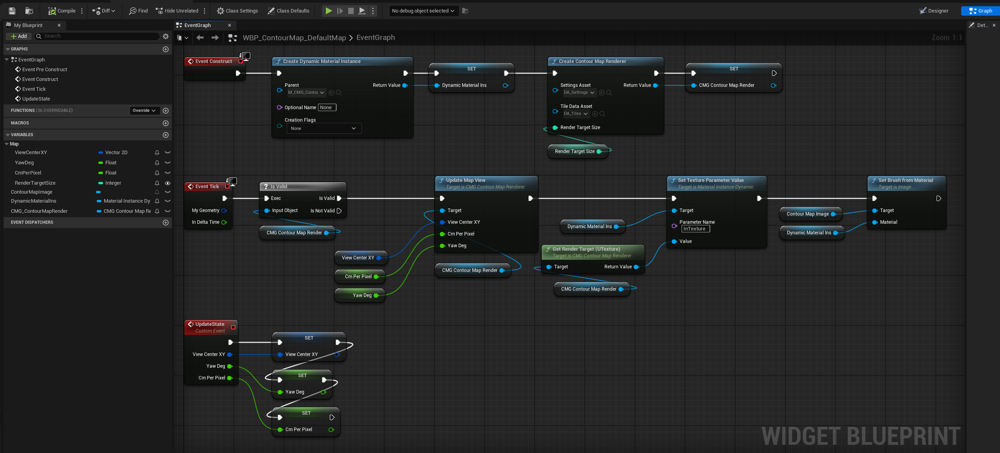


</details>

