# Contour Map Generator  


## 目次

- [同梱ファイル一覧](#同梱ファイル一覧)
- [クイックスタート](#クイックスタート)
- [U_CMG_ContourMapSettingsAsset の詳細](#u_cmg_contourmapsettingsasset-の詳細)
- [WB_CMG_ContourMapBase の作成方法](#wb_cmg_contourmapbase-の作成方法)


## 同梱ファイル一覧

```bash
ContourMapGenerator Content
├── DA_CMG_ContourMapSettings       : 等高線の詳細設定
├── DA_CMG_ContourMapTileList       : 使用する等高線画像の集合
├── EUW_CMG_CreateContourMap        : 等高線の画像を指定したフォルダにエクスポートする EditorUtilityWidget
├── EUW_CMG_TextureToDataAsset      : 等高線画像を指定した Data Asset にまとめる EditorUtilityWidget
├── WB_CMG_ContourMapBase           : デモマップの等高線を表示することが出来る
│   　                                  中心位置、向いている方向、ズーム倍率、マップの解像度を指定できる
├── Materials
│   ├── CMG_SampleTexture           : サンプル画像
│   ├── M_CMG_ContourMapMaterial    : UTexture から Material に変換する時に使用する
│   └── RoundMaskTexture              
└── Demo                              
    ├── ContourMapTexture           : エクスポートしたデモマップの等高線画像
    ├── Game
    │   ├── BP_CMG_Demo_GameMode           
    │   └── BP_CMG_DemoCharacter    : M キーを押すことで WBP_CMG_Demo_BigMap を表示することが出来る
    ├── Input
    │   ├── Actions                  
    │   └── IMC_CMG_Default           
    ├── Map                         : デモマップ
    └── UI
        ├── WBP_CMG_Demo_BigMap     : マウスカーソルにより等高線のズーム倍率を変更できる
        ├── WBP_CMG_Demo_KeyInfo
        └── WBP_CMG_Demo_MiniMap    : キャラクターの位置を中心とし、カメラが向いている方向を上向きにして等高線を表示する

```


## クイックスタート

### 1. プラグインをプロジェクトに導入
#### 1. Unreal Engine 5 を起動し、**Edit ▸ Plugins** で **Contour Map Generator** を有効化 

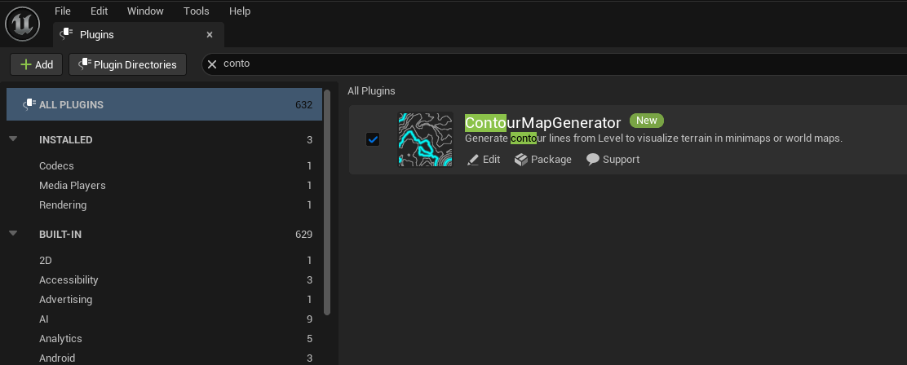

#### 2. エディタを再起動

### 2. マップの設定を作成
#### 1. コンテンツブラウザ上で U_CMG_ContourMapSettingsAsset を親に Data Asset を作成

<table>
<tr>
  <td>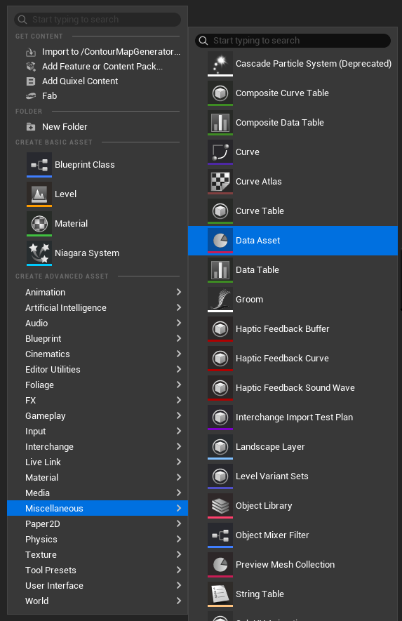
  <td>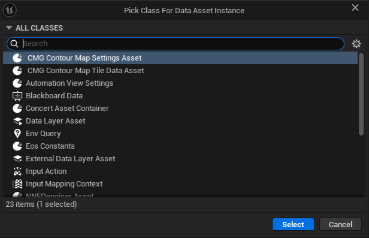
</tr>
</table>

#### 2. Data Asset の中身は [U_CMG_ContourMapSettingsAsset の詳細](#u_cmg_contourmapsettingsasset-の詳細) を参照


### 3. マップを用意

#### 1. 目的とするレベルを複製

#### 2. 等高線の出力に邪魔なものを削除(レベル上に配置してあるキャラクターなど)


### 画像の出力
#### 1. EditorUtilityWidget を起動
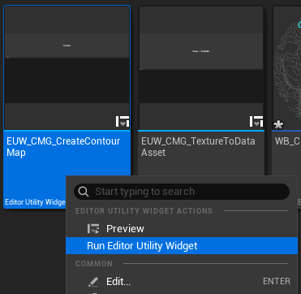


#### 2. フォルダの用意とフォルダパスの指定

<table>
<tr>
  <td>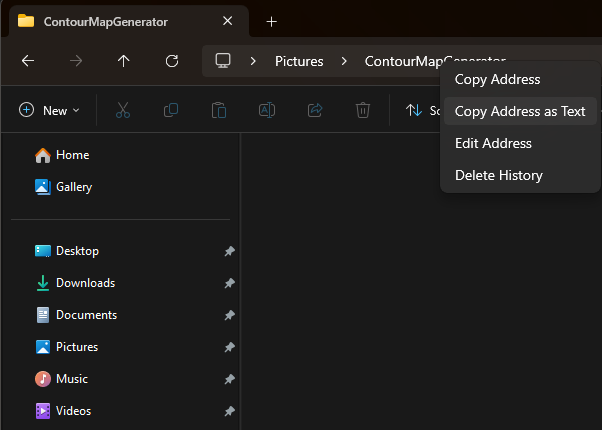
  <td>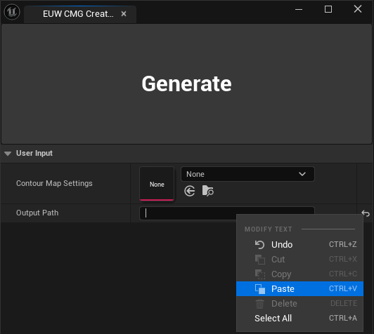
</tr>
</table>

#### 3. Data Asset の指定

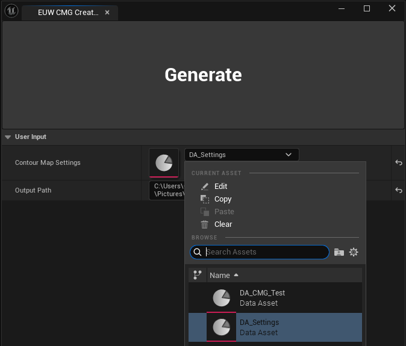


#### 4. [Generate]ボタンを押す

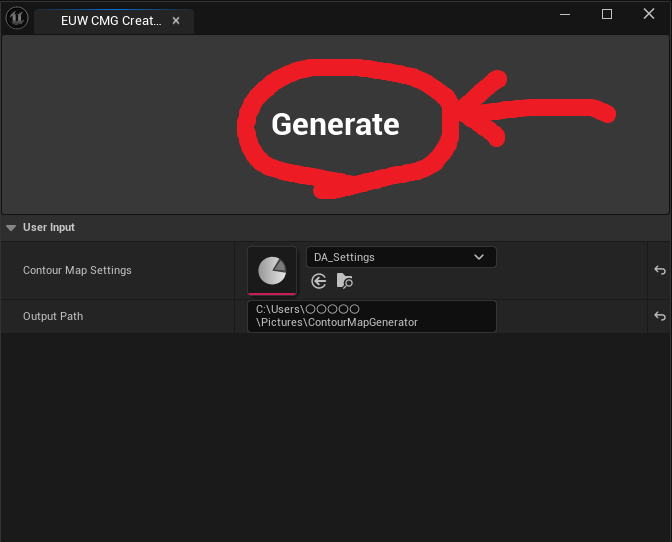


### 画像のインポート

#### 1. コンテンツブラウザ上に新たなフォルダを作成

#### 2. 出力した画像をインポート

#### 3. コンテンツブラウザ上で U_CMG_ContourMapTileDataAsset を親に Data Asset を作成
<table>
<tr>
  <td>
  <td>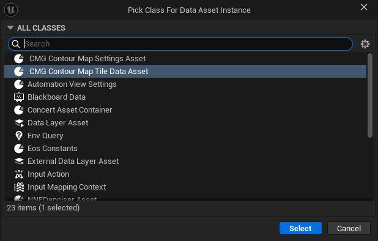
</tr>
</table>


#### 4. EditorUtilityWidget を起動
<table>
<tr>
  <td>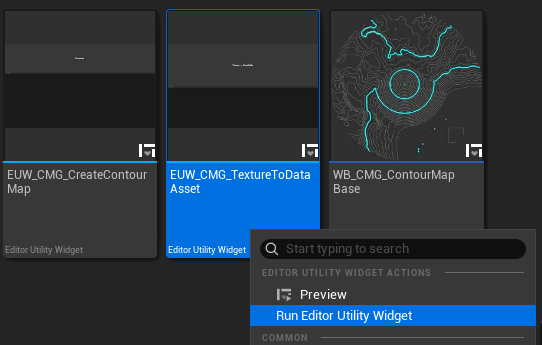
  <td>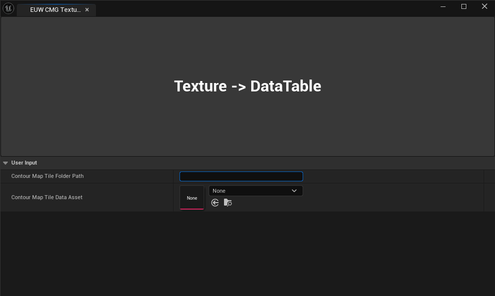
</tr>
</table>

#### 5. フォルダパス
- フォルダパスに改行が入っている場合、それを取り除く

<table>
<tr>
  <td>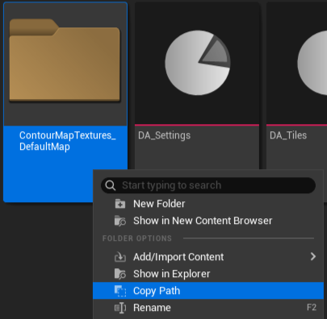
  <td>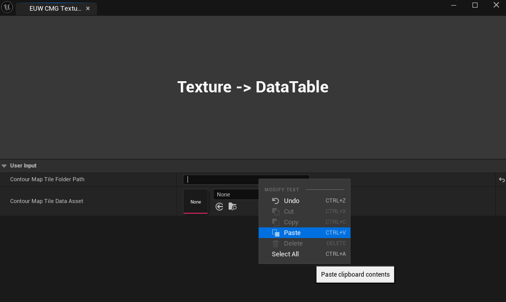
</tr>
</table>

#### 6. Data Asset を設定

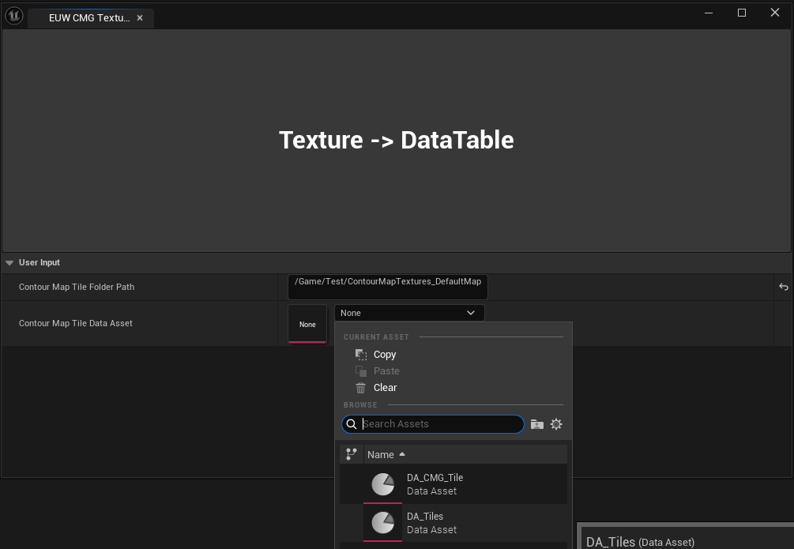

#### 7. [Texture -> DataTable]ボタンを押す

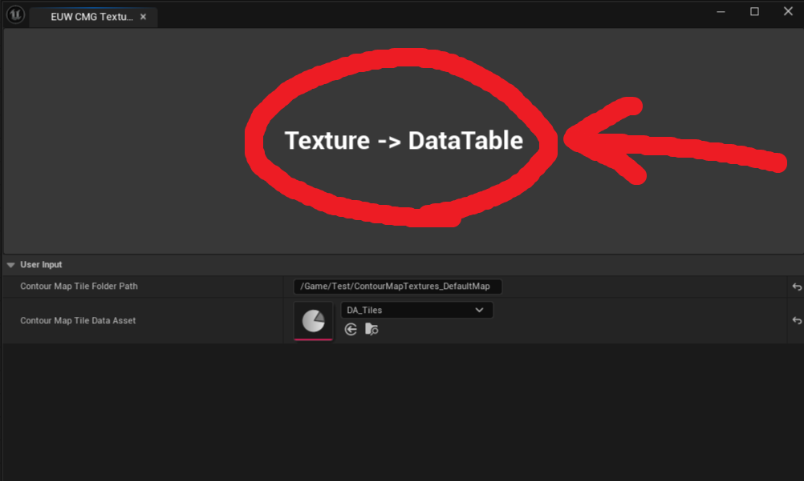

#### 8. このようにデータテーブルが作成されていると成功

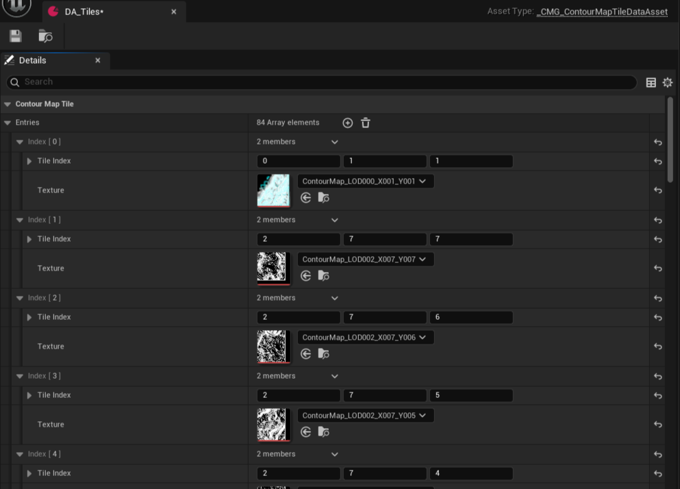


### 等高線を表示する Widget を作成　
- [WB_CMG_ContourMapBaseの作成方法はこちら](#wb_cmg_contourmapbase-の作成方法)

#### 1. WB_CMG_ContourMapBase を複製し名前を変更する

```bash
ContourMapGenerator Content
├── DA_CMG_ContourMapSettings
├── DA_CMG_ContourMapTileList
├── EUW_CMG_CreateContourMap
├── EUW_CMG_TextureToDataAsset
├── WB_CMG_ContourMapBase            <= これをコピー
├── Materials
└── Demo
```

#### 2. 中の Data Asset を変更する
- 1 で複製した Widget Blueprint を開く
- Graph タブを開き、Blueprint に移動する
- Create Contour Map Renderer ノードの SettingsAsset と TileDataAsset を作成した Data Asset に変更する

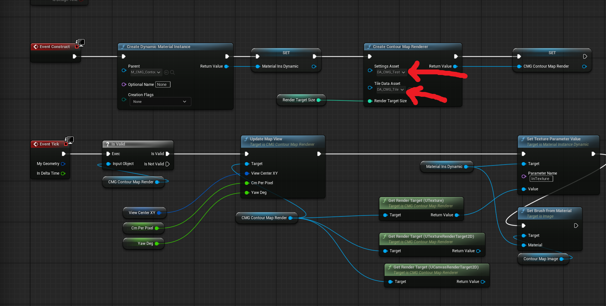


### WB_CMG_ContourMapBase の使用方法

```bash
ContourMapGenerator Content
├── DA_CMG_ContourMapSettings
├── DA_CMG_ContourMapTileList
├── EUW_CMG_CreateContourMap
├── EUW_CMG_TextureToDataAsset
├── WB_CMG_ContourMapBase
├── Materials
└── Demo
    ├── ContourMapTexture
    ├── Game
    ├── Input
    ├── Map
    └── UI
        ├── WBP_CMG_Demo_BigMap
        ├── WBP_CMG_Demo_KeyInfo
        └── WBP_CMG_Demo_MiniMap   <= これを参考にしてください
```

#### 1. 新たに Widget Blueprint を作成する

#### 2. WB_CMG_ContourMapBase を配置

- WB_CMG_ContourMapBase 又は、[等高線を表示する Widget を作成](#等高線を表示する-widget-を作成) で作成した Widget を配置

- WB_CMG_ContourMapBase のサイズを正方形となるように調整

- WB_CMG_ContourMapBase の IsVariable を true に

<table>
<tr>
  <td>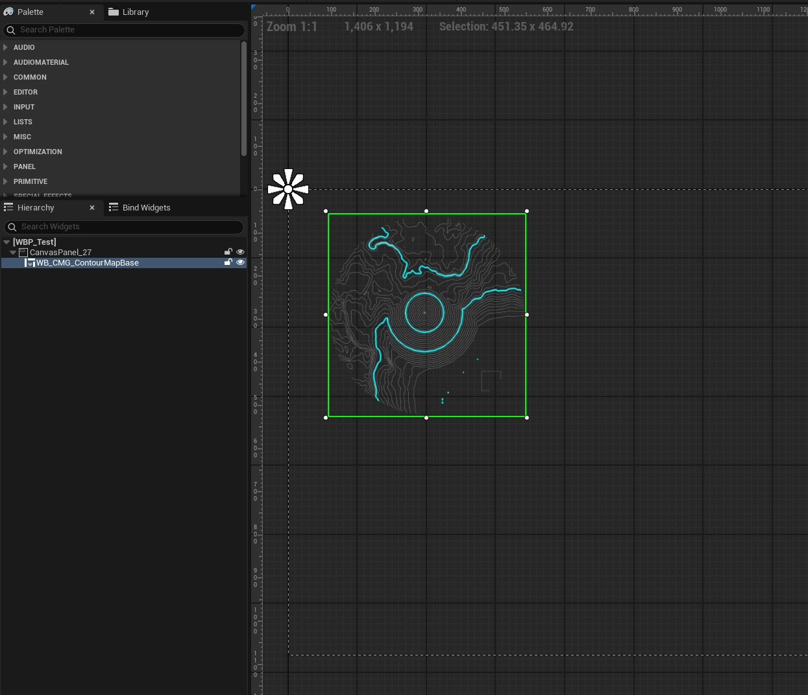
  <td>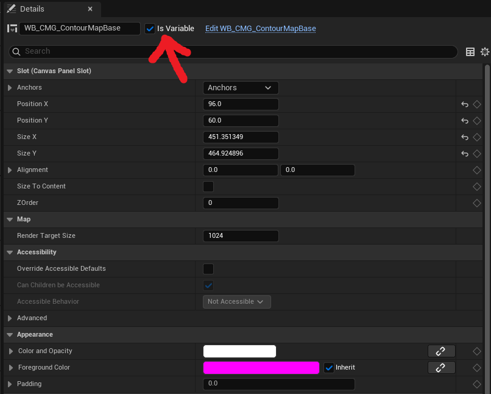
</tr>
</table>


#### 3. RenderTargetSize を設定
- この値は、UCMG_ContourMapRenderer から得られる画像の画素数

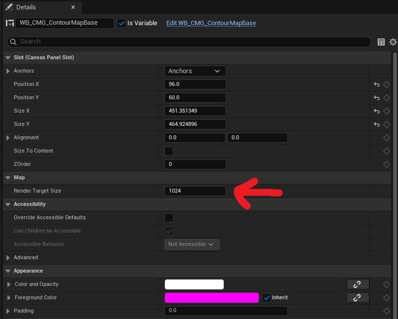

#### 4. 地図の中心位置、回転、ズーム倍率を設定する
- Graph に移行する
- UCMG_ContourMapRenderer から UpdateState 関数を呼び出す
- UpdateState 関数 を Event Tick に接続する
- ViewCenterXY に表示したい中心座標を代入する
- YawDeg に地図の回転角度を代入する
- CmPerPixel に表示するズーム倍率を代入する

<table>
<tr>
<td>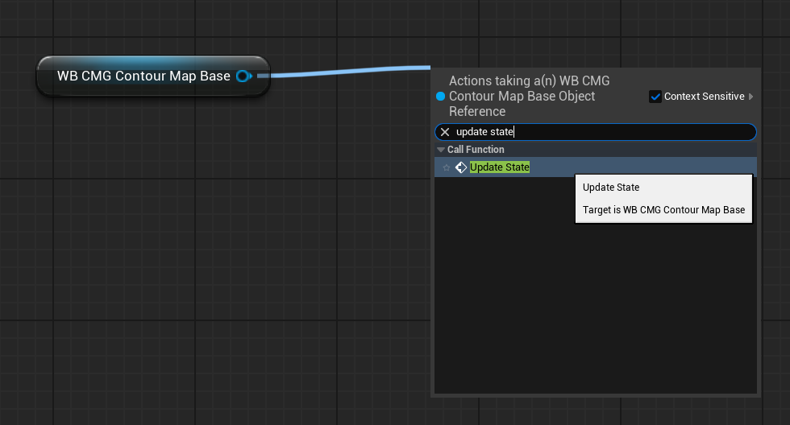
<td>
</tr>
</table>

<br>
<br>

---
<br>
<br>

#### 補足: UCMG_ContourMapRenderer について
- UCMG_ContourMapRenderer はインポートされた複数の画像から必要なものを繋ぎ合わせて一枚の等高線の画像(RenderTarget)を生成する。
- UCMG_ContourMapRenderer から得られる画像は縦横の大きさが同じ正方形の形をしている。
- UCMG_ContourMapRenderer から得られる画像の縦横の大きさは RenderTargetSize である。
- RenderTargetSize の値は UCMG_ContourMapRenderer 生成時に決定され、以降は変更できない。
- UCMG_ContourMapRenderer から得られる画像の中心位置はワールド座標で指定することが出来る。
- UCMG_ContourMapRenderer から得られる画像は回転を指定できる。
- UCMG_ContourMapRenderer から得られる画像はそのズーム倍率を指定することが出来る。
- CmPerPixel の値は、UCMG_ContourMapRenderer から得られる画像の1ピクセル分が、ワールド座標で何cmなのかを表す。


| 変数 |　型　| 詳細 |　その他　|
| --- | --- | --- | --- |
| RenderTargetSize |　int　|　UCMG_ContourMapRenderer から得られる画像の大きさ　|　UCMG_ContourMapRenderer 生成時に決定 |
| ViewCenterXY | FVector2D | 中心位置のワールド座標(X,Y) ||
| YawDeg | float | UCMG_ContourMapRenderer から得られる画像の回転角度 ||
| CmPerPixel | float | この値に RenderTargetSize を掛けたものが得られる画像の表示範囲となる ||

<br>
<br>

---

<br>
<br>

## U_CMG_ContourMapSettingsAsset の詳細
<details>
<summary><strong>U_CMG_ContourMapSettingsAsset の詳細</strong></summary>


#### MapCoverage
- 地図範囲をワールド座標で示す

<table>
<tr>
  <td>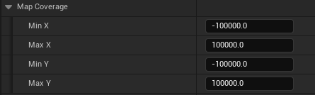
  <td>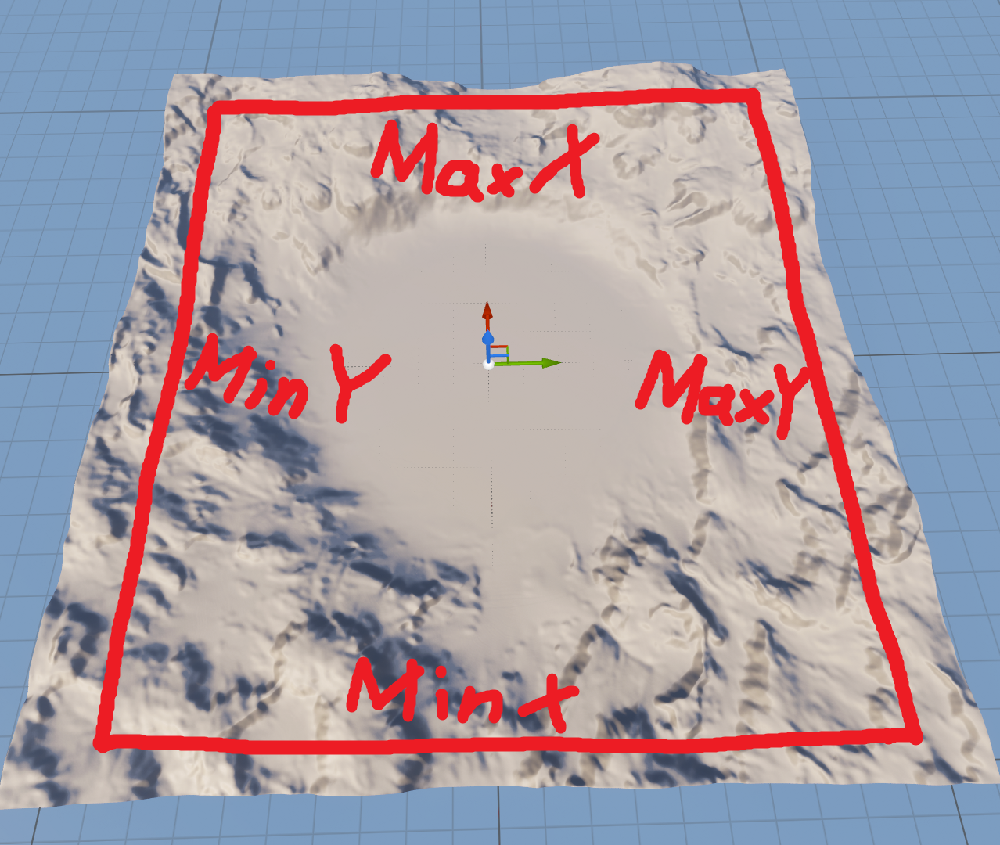
</tr>
</table>


#### HeightRangeCm
- 地形をスキャンする時に使う高さの範囲の最小値と最大値

<table>
<tr>
  <td>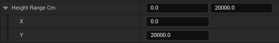
  <td>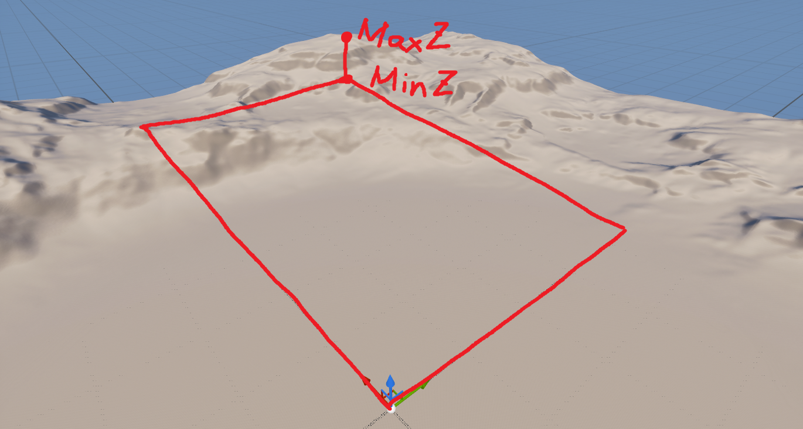
</tr>
</table>

#### ContourLineZOffset
- 等高線を描画する高さをずらすための値
- 等高線の高さと、平たい地形の高さが同じになることで線がきれいに描画できないときに使う

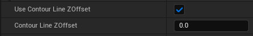

#### TileResolution
- 等高線の画像は複数の画像に分割されて保存される
- 分割して保存するた画像の縦横の解像度を入力する

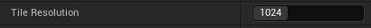

#### LODSettings
- 複数のズーム倍率で等高線の画像を保存することが出来る
- マップを表示する際、ズーム倍率に応じて最適な LODSetting を自動で選択して表示する

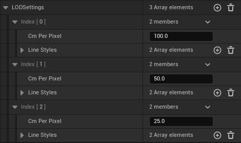


#### CmPerPixel
- 1 ピクセルがワールド上で表す長さ（センチメートル）。値が大きいほど縮尺が小さくなり、マップが引きで表示される。


#### LineStyles
- 描画する等高線の種類
- 以下の画像では、20m間隔の太い青線と2m間隔の細い白線を描く

<table>
<tr>
  <td>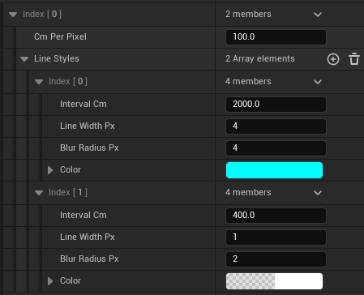
  <td>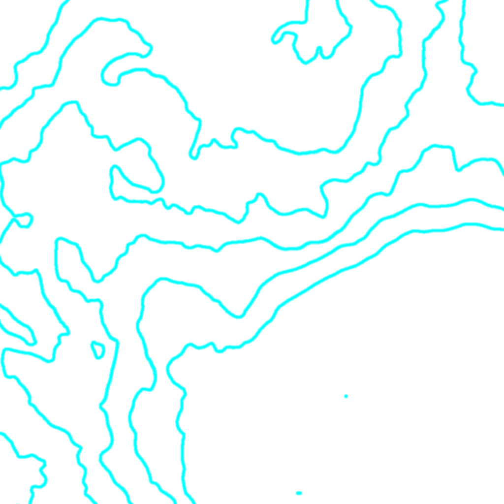
</tr>
</table>

#### IntervalCm
- 等高線を描く高さ方向の間隔 (センチメートル)

#### LineWidthPx
- 描画する等高線の濃い部分の太さ

#### BlurRadiusPx
- 等高線画像にかけるぼかし半径 (px)
- 大きいほど輪郭が滑らかになるが、細部が失われる

#### Color
- 等高線の色
- 透明度も使用できる


</details>


<br>
<br>


## WB_CMG_ContourMapBase の作成方法

<details>
<summary><strong> WB_CMG_ContourMapBase の作成方法</strong></summary>

#### 1. 新しい Widget Blueprint を作成

<table>
<tr>
  <td>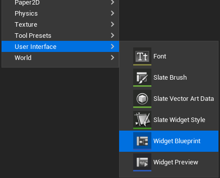
  <td>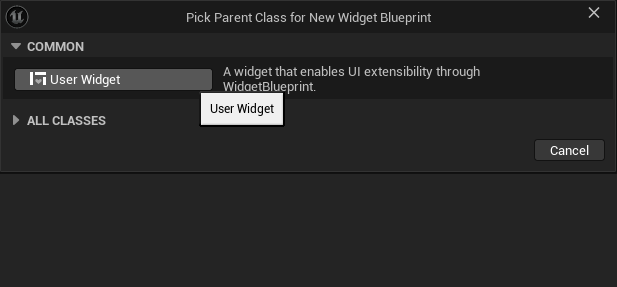
</tr>
</table>

#### 2. 新たな Image を配置
- Imageの名前を ContourMapImage とする
- 設定の IsVariable をtrueにする
- 設定の Appearance->Brush->DrawAs を Rounded Box に変更する

<table>
<tr>
  <td>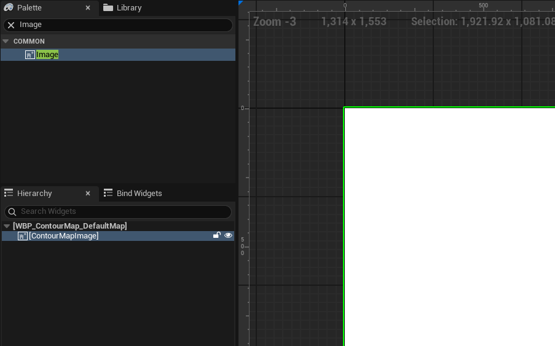
  <td>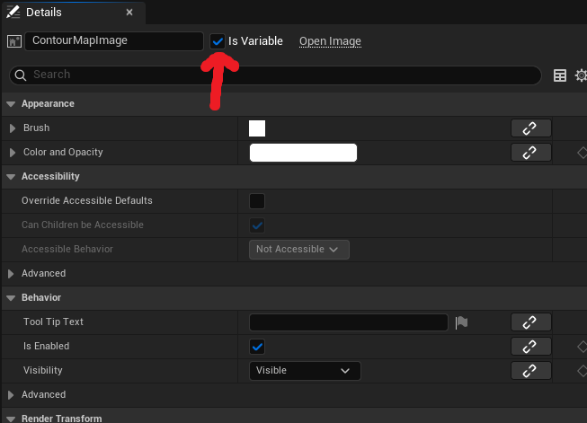
  <td>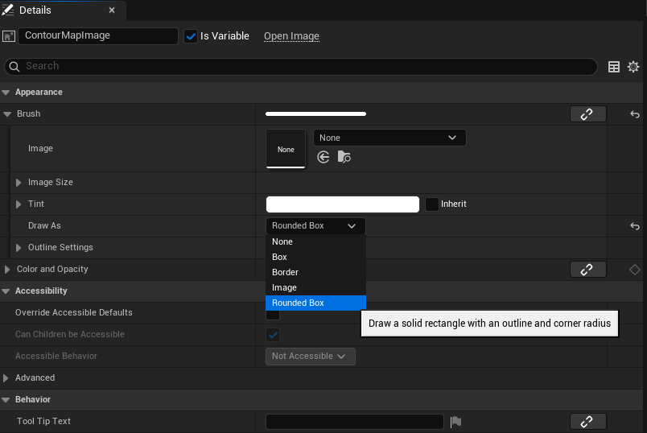
</tr>
</table>

#### 3. Graph に移行し、新たな変数を作成する

| 型 |　変数名 |
| --------------- | ---------------- |
| FVector2D |ViewCenterXY |
| float |YawDeg |
| float |CmPerPixel |
| int | RenderTargetSize |

#### 4. RenderTargetSize のDetailを変更
- Instance Editable を true に
- Expose on Spawn を true に

<table>
<tr>
  <td>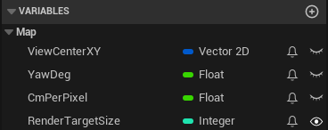
  <td>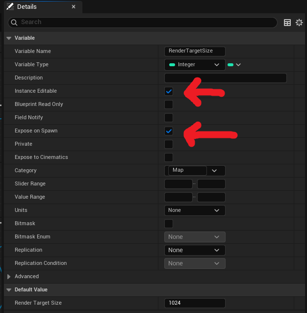
</tr>
</table>

#### 5. 新たなイベントを作成
- Add Custom Event により新たなイベントを作成
- イベントの名前を UpdateState に変更
- 3 で作成した変数をイベントに接続

<table>
<tr>
  <td>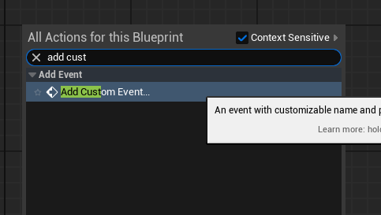
  <td>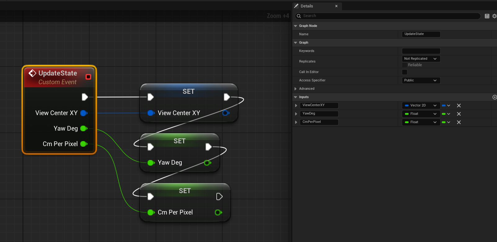
</tr>
</table>

#### 6. Create Dynamic Material Instance を作成
- Parent には M_CMG_ContourMap を設定
- Return Value を変数(DynamicMaterialIns)にする

<table>
<tr>
  <td>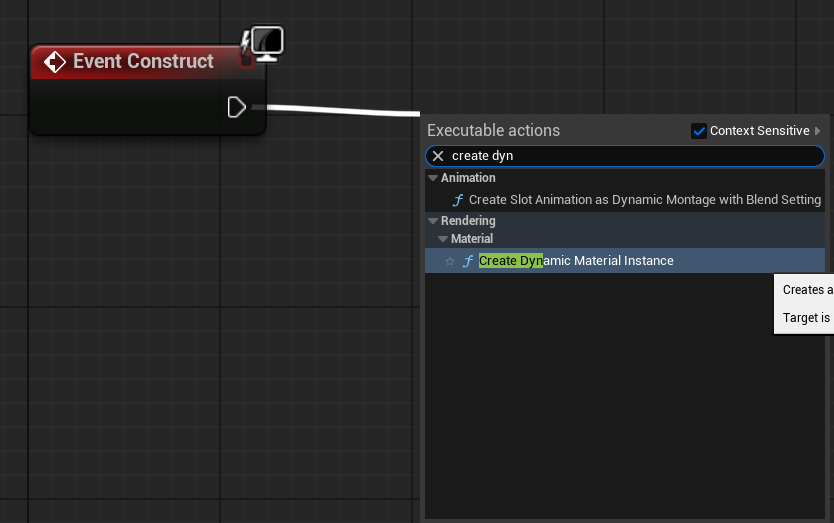
  <td>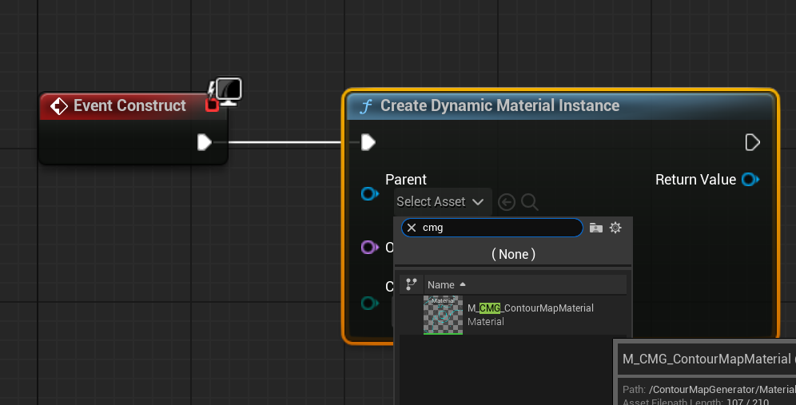
  <td>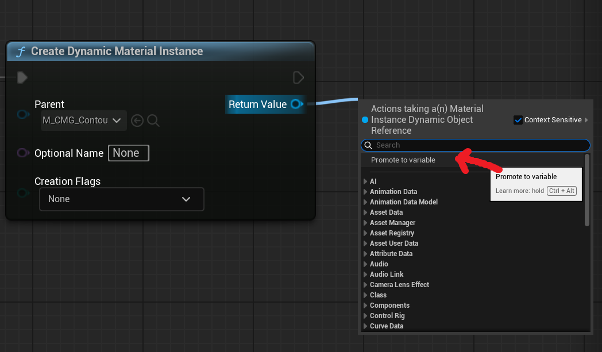
  <td>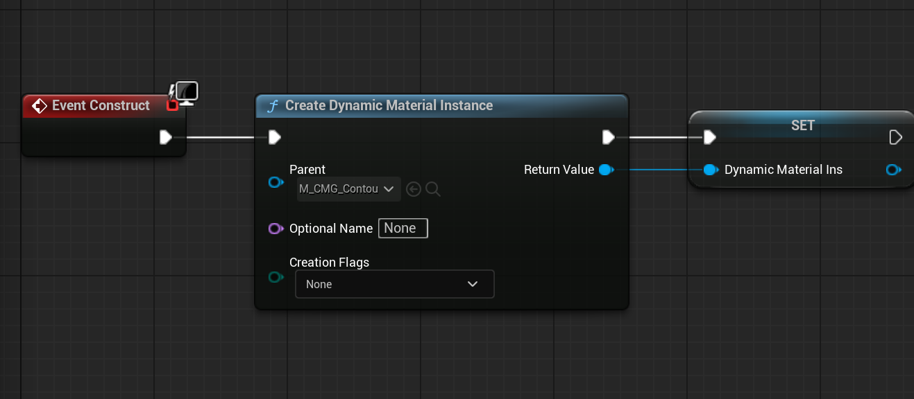
</tr>
</table>

#### 7. Create Contour Map Render を作成
- Setting Asset に作成した Data Asset を代入
- Tile Data Asset　に作成した Data Asset を代入
- Render Target Size に作成した変数 RenderTargetSize を代入
- Return Value を変数(CMG_ContourMapRender)にする

<table>
<tr>
  <td>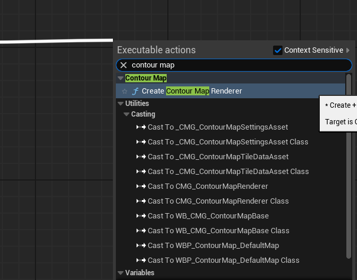
  <td>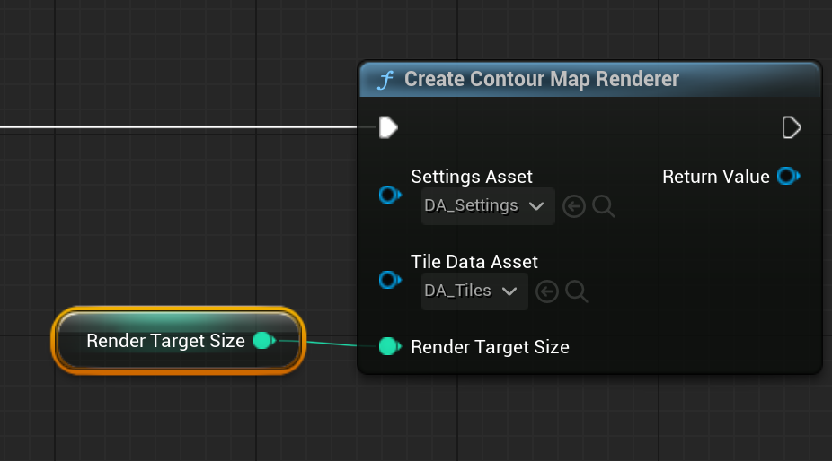
  <td>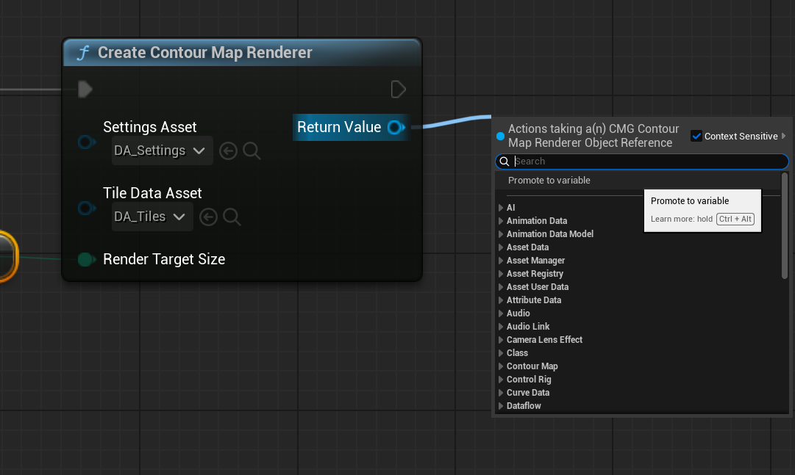
  <td>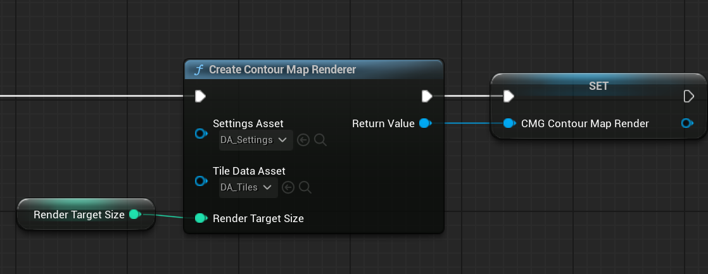
</tr>
</table>

#### 8. 6 7 で作成したものを　Event Construct　に繋げる

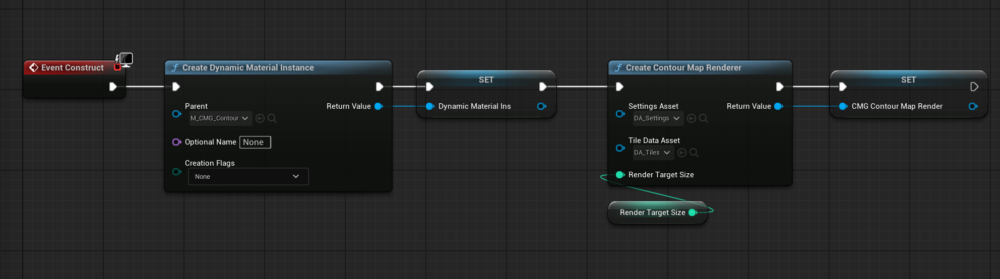

#### 9. IsValidを作成
- Input Object に　7 で作成した CMG_ContourMapRender を代入

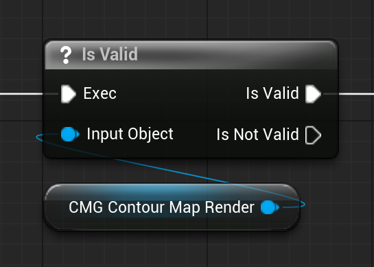

#### 10. UpdateMapViewを作成
- Target に 7 で作成した CMG_ContourMapRender を代入
- ViewCenterXY に 3 で作成した ViewCenterXY を代入
- CmPerPixel に 3 で作成した CmPerPixel を代入
- YawDeg に 3 で作成した YawDeg を代入

<table>
<tr>
  <td>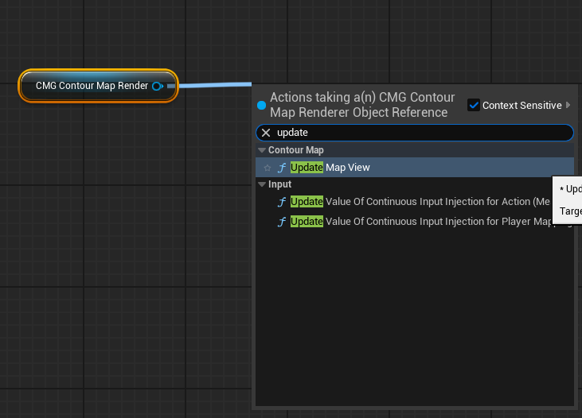
  <td>
</tr>
</table>

#### 11. SetTextureParameterValueを作成
- 6 で作成した DynamicMaterialIns から SetTextureParameterValue を作成
- Parameter Name を InTexture に変更
- Value に 7 で作成した CMG_ContourMapRender から取得できる GetRenderTarget(UTexture) を代入

<table>
<tr>
  <td>
  <td>
  <td>
</tr>
</table>

#### 12. SetBrushFromMaterial を作成
- 2 で作成した ContourMapImage から　SetBrushFromMaterial を作成
- Material に 6 で作成した DynamicMaterialIns を代入

<table>
<tr>
  <td>
  <td>
</tr>
</table>

#### 13. 9～12　で作成したものを Event Tick に接続


#### 14. 全体像


</details>